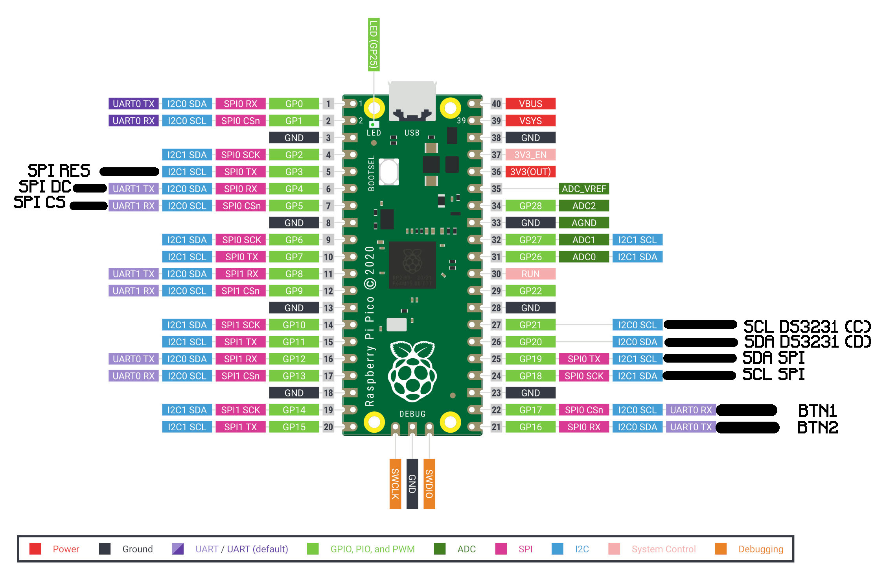

# **⌚Oled Display📺**


## Hardware Used🔌
- **Raspberry Pi PICO** (1st gen)
- **DS3231 RTC Module** (i2c)
- **SH1122 Oled Display** (SPI)


## Pinout 📍


### 📺 SH1122 Oled display connections:
+ **SPI RES** -> Active Low Reset Signal
+ **SPI DC**  -> H:Data L:Command 
+ **SPI CS**  -> Chip Select
+ **SPI SDA** -> Serial Data Input
+ **SPI SCL** -> Serial Clock Signal

### 🕹 Input Buttons connections:
+ **BTN1** -> Edit Mode Button (for clock current time modification)
+ **BTN2** -> Date Button (for changing current Mode to draw date, or number select in edit mode)

### ⌚ DS3231 RTC connections:
+ **i2c SCL (C)** -> Serial Clock Signal
+ **i2c SDA (D)** -> Serial Data Signal

## 💾Installation💾
### Setup PICO SDK
1. Install CMake (at least version 3.13), and a GCC cross compiler
```
sudo apt install cmake gcc-arm-none-eabi libnewlib-arm-none-eabi libstdc++-arm-none-eabi-newlib
```
2. Setup fetch pico sdk from github
```
git clone https://github.com/raspberrypi/pico-sdk.git
export PICO_SDK_PATH={YOUR PATH}
```
You can add export to .bashrc


### Setup Oled Display 📺
1. Fetching Project
```
git clone https://github.com/Yabkoy/OledDisplay.git
cd OledDisplay
```

2. Configuring your setup
In CMakeLists.txt you can change the pins of any connector that is connected to your board, or enable/disable an animated intro.

3. Building Project:
```
mkdir build
cd build
cmake ..
make
```
4. Uploading executable to the board:
After building you will get executables (.bin, .elf, .uf2), that you can simpli upload to your raspberry pi pico.
The simplest way is to just drag and drop a .uf2 file to raspberry pi pico debug drive.

# License
Distributed under the CC BY-NC-SA 4.0 License. See [this](LICENSE) for more information.